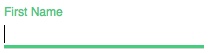

# material-ui-input

*Simple and styled input - like material ui input text*

In HTML5, you can have a text input field 
Please see the styled input component as below, 

# Install

`$ npm install material-ui-input --save`

# Demo

##### [Click Here to see the demo](https://material-ui-input-bnxnbikevf.now.sh/demo)

# Usage

*Step 1:*

    

    
*Step 2:*

    $('.material-ui-input').materialUiInput()
    
*You can get the input value like this*

    $('.material-ui-input').getInputValue()

# Props

   | Property | Value |
   | ------------- | ------------- |
   | label  | string  |
   | required  | boolean  |
   
# Examples
    
    Example 1: 

    
    Example 2: 

    
    
### Note:

Please include the jquery in your html

    npm i jquery
    
    or 
    
    